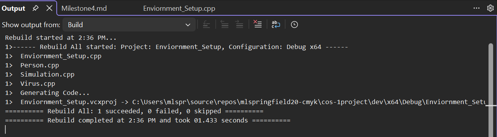
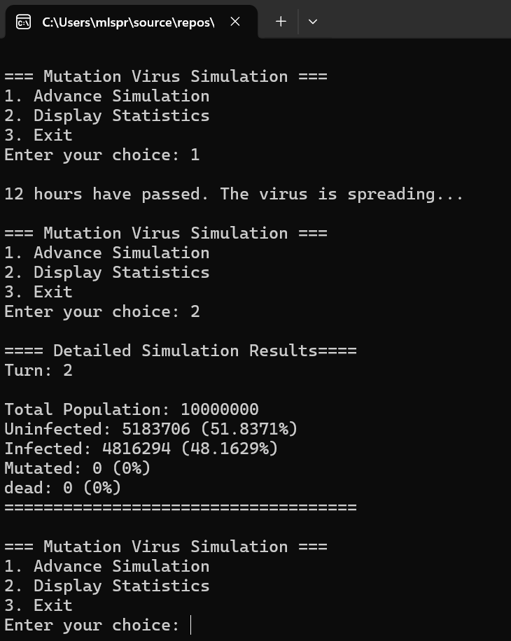

# Milestone 4

## Final Features Added

During this milestone I completed the Mutation Virus Simulation project. 
I added user-controlled simulation advancement so the user can choose when to advance the simulation instead of having it run automatically.
The simulation now processes infections, mutations, and deaths while tracking changes across the population. 
Statistics are displayed for uninfected, infected, mutated, and deceased individuals, allowing the user to monitor the progression of the virus over time.

## Refactoring Improvements

Throughout development I continued improving the organization of the code.
I separated responsibilities between the Person, Virus, and Simulation classes and reviewed the code to improve readability and maintainability. 
I also refined the simulation flow to make the program easier to understand and use.

## Bug Fixes and Usability Updates

Several issues were identified and corrected during testing.
I fixed problems related to population initialization and percentage calculations. 
I also improved menu navigation and input validation to provide a better user experience. 
These updates helped make the simulation more stable and reliable.

## Final Testing

I performed multiple tests to verify that all core features function correctly. 
Testing included advancing simulation turns, displaying population statistics, verifying infection spread, mutation processing, death processing, and validating menu input. 
The program was tested repeatedly to ensure statistics updated correctly after each turn and that the simulation behaved as expected.

### Successful Compilation

### Successful Compilation

### Successful Compilation

### Program Running

## Project Status

The Mutation Virus Simulation project is now complete and fully functional. 
Throughout this course I developed the project from an initial concept into a working simulation using object-oriented programming principles. 
The final program allows users to control the simulation, observe the spread of the virus, and analyze population statistics through an interactive menu-driven interface.